# 机器学习学习笔记-Kaggle加州房价预测-高级回归技术

1. **导入必要的库**：我们将使用`numpy`、`pandas`、`matplotlib`、`seaborn`等库来处理数据和可视化。
```python
# 📚 数据处理
import numpy as np  # 导入数值计算库，用于数组和矩阵操作
import pandas as pd  # 导入数据处理库，用于数据读取和处理

# 📊 可视化
import matplotlib.pyplot as plt  # 导入绘图库，用于绘制各种图表
import seaborn as sns  # 导入高级绘图库，基于matplotlib，便于绘制统计图表

# 🔍 数据统计
from scipy.stats import norm, skew  # 导入正态分布和偏度函数，用于统计分析
from scipy import stats  # 导入统计模块，包含多种统计函数

# ⚠️ 警告提示
import warnings  # 导入警告模块，用于控制警告信息显示

warnings.filterwarnings('ignore')  # 忽略所有警告信息，保持输出整洁

# 🎨 可视化风格
sns.set(style="whitegrid")  # 设置seaborn绘图风格为白色网格背景

from sklearn.preprocessing import LabelEncoder  # 导入标签编码器，用于类别变量编码
from sklearn.model_selection import KFold  # 导入K折交叉验证模块
from sklearn.metrics import mean_squared_error  # 导入均方误差评估指标

import lightgbm as lgb  # 导入LightGBM库，用于梯度提升树模型
from lightgbm import early_stopping, log_evaluation  # 导入LightGBM的早停和日志评估回调函数

print("✅ Libraries Imported Successfully!")  # 打印导入成功提示
```

    ✅ Libraries Imported Successfully!
    
成功导入数据处理、可视化、统计分析和机器学习建模所需的所有库，包括NumPy、Pandas、Matplotlib、Seaborn、Scipy和LightGBM等核心工具。特别设置了可视化风格为白色网格背景，并忽略警告信息，确保后续分析和建模过程输出整洁无干扰。


2. **载入数据集**：使用`pandas`读取训练和测试数据集。
```python
# 📥 载入数据集
train = pd.read_csv("train.csv")
test = pd.read_csv("test.csv")

# 🔍 初步分析
print("✅ Data Loaded Successfully!")

# 🔢 数据集的形状
print(f"📌 Training Data Shape: {train.shape}")
print(f"📌 Test Data Shape: {test.shape}")

# 🔎 训练数据的初步观察
print("\n🔹 First 5 rows of Training Data:")
display(train.head())

# 🔎 测试数据的初步观察
print("\n🔹 First 5 rows of Test Data:")
display(test.head())
```

    ✅ Data Loaded Successfully!
    📌 Training Data Shape: (1460, 81)
    📌 Test Data Shape: (1459, 80)
    
    🔹 First 5 rows of Training Data:
    


<div>
<style scoped>
    .dataframe tbody tr th:only-of-type {
        vertical-align: middle;
    }

    .dataframe tbody tr th {
        vertical-align: top;
    }

    .dataframe thead th {
        text-align: right;
    }
</style>
<table border="1" class="dataframe">
  <thead>
    <tr style="text-align: right;">
      <th></th>
      <th>Id</th>
      <th>MSSubClass</th>
      <th>MSZoning</th>
      <th>LotFrontage</th>
      <th>LotArea</th>
      <th>Street</th>
      <th>Alley</th>
      <th>LotShape</th>
      <th>LandContour</th>
      <th>Utilities</th>
      <th>...</th>
      <th>PoolArea</th>
      <th>PoolQC</th>
      <th>Fence</th>
      <th>MiscFeature</th>
      <th>MiscVal</th>
      <th>MoSold</th>
      <th>YrSold</th>
      <th>SaleType</th>
      <th>SaleCondition</th>
      <th>SalePrice</th>
    </tr>
  </thead>
  <tbody>
    <tr>
      <th>0</th>
      <td>1</td>
      <td>60</td>
      <td>RL</td>
      <td>65.0</td>
      <td>8450</td>
      <td>Pave</td>
      <td>NaN</td>
      <td>Reg</td>
      <td>Lvl</td>
      <td>AllPub</td>
      <td>...</td>
      <td>0</td>
      <td>NaN</td>
      <td>NaN</td>
      <td>NaN</td>
      <td>0</td>
      <td>2</td>
      <td>2008</td>
      <td>WD</td>
      <td>Normal</td>
      <td>208500</td>
    </tr>
    <tr>
      <th>1</th>
      <td>2</td>
      <td>20</td>
      <td>RL</td>
      <td>80.0</td>
      <td>9600</td>
      <td>Pave</td>
      <td>NaN</td>
      <td>Reg</td>
      <td>Lvl</td>
      <td>AllPub</td>
      <td>...</td>
      <td>0</td>
      <td>NaN</td>
      <td>NaN</td>
      <td>NaN</td>
      <td>0</td>
      <td>5</td>
      <td>2007</td>
      <td>WD</td>
      <td>Normal</td>
      <td>181500</td>
    </tr>
    <tr>
      <th>2</th>
      <td>3</td>
      <td>60</td>
      <td>RL</td>
      <td>68.0</td>
      <td>11250</td>
      <td>Pave</td>
      <td>NaN</td>
      <td>IR1</td>
      <td>Lvl</td>
      <td>AllPub</td>
      <td>...</td>
      <td>0</td>
      <td>NaN</td>
      <td>NaN</td>
      <td>NaN</td>
      <td>0</td>
      <td>9</td>
      <td>2008</td>
      <td>WD</td>
      <td>Normal</td>
      <td>223500</td>
    </tr>
    <tr>
      <th>3</th>
      <td>4</td>
      <td>70</td>
      <td>RL</td>
      <td>60.0</td>
      <td>9550</td>
      <td>Pave</td>
      <td>NaN</td>
      <td>IR1</td>
      <td>Lvl</td>
      <td>AllPub</td>
      <td>...</td>
      <td>0</td>
      <td>NaN</td>
      <td>NaN</td>
      <td>NaN</td>
      <td>0</td>
      <td>2</td>
      <td>2006</td>
      <td>WD</td>
      <td>Abnorml</td>
      <td>140000</td>
    </tr>
    <tr>
      <th>4</th>
      <td>5</td>
      <td>60</td>
      <td>RL</td>
      <td>84.0</td>
      <td>14260</td>
      <td>Pave</td>
      <td>NaN</td>
      <td>IR1</td>
      <td>Lvl</td>
      <td>AllPub</td>
      <td>...</td>
      <td>0</td>
      <td>NaN</td>
      <td>NaN</td>
      <td>NaN</td>
      <td>0</td>
      <td>12</td>
      <td>2008</td>
      <td>WD</td>
      <td>Normal</td>
      <td>250000</td>
    </tr>
  </tbody>
</table>
<p>5 rows × 81 columns</p>
</div>


    
    🔹 First 5 rows of Test Data:
    


<div>
<style scoped>
    .dataframe tbody tr th:only-of-type {
        vertical-align: middle;
    }

    .dataframe tbody tr th {
        vertical-align: top;
    }

    .dataframe thead th {
        text-align: right;
    }
</style>
<table border="1" class="dataframe">
  <thead>
    <tr style="text-align: right;">
      <th></th>
      <th>Id</th>
      <th>MSSubClass</th>
      <th>MSZoning</th>
      <th>LotFrontage</th>
      <th>LotArea</th>
      <th>Street</th>
      <th>Alley</th>
      <th>LotShape</th>
      <th>LandContour</th>
      <th>Utilities</th>
      <th>...</th>
      <th>ScreenPorch</th>
      <th>PoolArea</th>
      <th>PoolQC</th>
      <th>Fence</th>
      <th>MiscFeature</th>
      <th>MiscVal</th>
      <th>MoSold</th>
      <th>YrSold</th>
      <th>SaleType</th>
      <th>SaleCondition</th>
    </tr>
  </thead>
  <tbody>
    <tr>
      <th>0</th>
      <td>1461</td>
      <td>20</td>
      <td>RH</td>
      <td>80.0</td>
      <td>11622</td>
      <td>Pave</td>
      <td>NaN</td>
      <td>Reg</td>
      <td>Lvl</td>
      <td>AllPub</td>
      <td>...</td>
      <td>120</td>
      <td>0</td>
      <td>NaN</td>
      <td>MnPrv</td>
      <td>NaN</td>
      <td>0</td>
      <td>6</td>
      <td>2010</td>
      <td>WD</td>
      <td>Normal</td>
    </tr>
    <tr>
      <th>1</th>
      <td>1462</td>
      <td>20</td>
      <td>RL</td>
      <td>81.0</td>
      <td>14267</td>
      <td>Pave</td>
      <td>NaN</td>
      <td>IR1</td>
      <td>Lvl</td>
      <td>AllPub</td>
      <td>...</td>
      <td>0</td>
      <td>0</td>
      <td>NaN</td>
      <td>NaN</td>
      <td>Gar2</td>
      <td>12500</td>
      <td>6</td>
      <td>2010</td>
      <td>WD</td>
      <td>Normal</td>
    </tr>
    <tr>
      <th>2</th>
      <td>1463</td>
      <td>60</td>
      <td>RL</td>
      <td>74.0</td>
      <td>13830</td>
      <td>Pave</td>
      <td>NaN</td>
      <td>IR1</td>
      <td>Lvl</td>
      <td>AllPub</td>
      <td>...</td>
      <td>0</td>
      <td>0</td>
      <td>NaN</td>
      <td>MnPrv</td>
      <td>NaN</td>
      <td>0</td>
      <td>3</td>
      <td>2010</td>
      <td>WD</td>
      <td>Normal</td>
    </tr>
    <tr>
      <th>3</th>
      <td>1464</td>
      <td>60</td>
      <td>RL</td>
      <td>78.0</td>
      <td>9978</td>
      <td>Pave</td>
      <td>NaN</td>
      <td>IR1</td>
      <td>Lvl</td>
      <td>AllPub</td>
      <td>...</td>
      <td>0</td>
      <td>0</td>
      <td>NaN</td>
      <td>NaN</td>
      <td>NaN</td>
      <td>0</td>
      <td>6</td>
      <td>2010</td>
      <td>WD</td>
      <td>Normal</td>
    </tr>
    <tr>
      <th>4</th>
      <td>1465</td>
      <td>120</td>
      <td>RL</td>
      <td>43.0</td>
      <td>5005</td>
      <td>Pave</td>
      <td>NaN</td>
      <td>IR1</td>
      <td>HLS</td>
      <td>AllPub</td>
      <td>...</td>
      <td>144</td>
      <td>0</td>
      <td>NaN</td>
      <td>NaN</td>
      <td>NaN</td>
      <td>0</td>
      <td>1</td>
      <td>2010</td>
      <td>WD</td>
      <td>Normal</td>
    </tr>
  </tbody>
</table>
<p>5 rows × 80 columns</p>
</div>


训练集包含1460个样本和81个特征（含目标变量SalePrice），测试集包含1459个样本和80个特征。初步观察发现数据集混合了数值型和类别型特征，且存在明显的缺失值（如Alley、PoolQC等字段），这为后续的数据清洗和特征工程提供了方向。


3. **数据类型和信息**：查看数据集的基本信息，包括每列的数据类型和非空值数量。
```python
# 🔬 数据类型和信息
print("\n🔹 Training Data Information:")
train.info()

print("\n🔹 Test Data Information:")
test.info()

# 📈 基本统计信息
print("\n🔹 Basic Statistics of Numerical Features (Train Data):")
display(train.describe())

print("\n🔹 Basic Statistics of Numerical Features (Test Data):")
display(test.describe())

# 📑 类别特征的唯一值数量
print("\n🔹 Unique Values in Categorical Features (Training Data):")
categorical_cols = train.select_dtypes(include=['object']).columns
for col in categorical_cols:
    print(f"{col}: {train[col].nunique()} unique values")
```

    
    🔹 Training Data Information:
    <class 'pandas.core.frame.DataFrame'>
    RangeIndex: 1460 entries, 0 to 1459
    Data columns (total 81 columns):
     #   Column         Non-Null Count  Dtype  
    ---  ------         --------------  -----  
     0   Id             1460 non-null   int64  
     1   MSSubClass     1460 non-null   int64  
     2   MSZoning       1460 non-null   object 
     3   LotFrontage    1201 non-null   float64
     4   LotArea        1460 non-null   int64  
     5   Street         1460 non-null   object 
     6   Alley          91 non-null     object 
     7   LotShape       1460 non-null   object 
     8   LandContour    1460 non-null   object 
     9   Utilities      1460 non-null   object 
     10  LotConfig      1460 non-null   object 
     11  LandSlope      1460 non-null   object 
     12  Neighborhood   1460 non-null   object 
     13  Condition1     1460 non-null   object 
     14  Condition2     1460 non-null   object 
     15  BldgType       1460 non-null   object 
     16  HouseStyle     1460 non-null   object 
     17  OverallQual    1460 non-null   int64  
     18  OverallCond    1460 non-null   int64  
     19  YearBuilt      1460 non-null   int64  
     20  YearRemodAdd   1460 non-null   int64  
     21  RoofStyle      1460 non-null   object 
     22  RoofMatl       1460 non-null   object 
     23  Exterior1st    1460 non-null   object 
     24  Exterior2nd    1460 non-null   object 
     25  MasVnrType     588 non-null    object 
     26  MasVnrArea     1452 non-null   float64
     27  ExterQual      1460 non-null   object 
     28  ExterCond      1460 non-null   object 
     29  Foundation     1460 non-null   object 
     30  BsmtQual       1423 non-null   object 
     31  BsmtCond       1423 non-null   object 
     32  BsmtExposure   1422 non-null   object 
     33  BsmtFinType1   1423 non-null   object 
     34  BsmtFinSF1     1460 non-null   int64  
     35  BsmtFinType2   1422 non-null   object 
     36  BsmtFinSF2     1460 non-null   int64  
     37  BsmtUnfSF      1460 non-null   int64  
     38  TotalBsmtSF    1460 non-null   int64  
     39  Heating        1460 non-null   object 
     40  HeatingQC      1460 non-null   object 
     41  CentralAir     1460 non-null   object 
     42  Electrical     1459 non-null   object 
     43  1stFlrSF       1460 non-null   int64  
     44  2ndFlrSF       1460 non-null   int64  
     45  LowQualFinSF   1460 non-null   int64  
     46  GrLivArea      1460 non-null   int64  
     47  BsmtFullBath   1460 non-null   int64  
     48  BsmtHalfBath   1460 non-null   int64  
     49  FullBath       1460 non-null   int64  
     50  HalfBath       1460 non-null   int64  
     51  BedroomAbvGr   1460 non-null   int64  
     52  KitchenAbvGr   1460 non-null   int64  
     53  KitchenQual    1460 non-null   object 
     54  TotRmsAbvGrd   1460 non-null   int64  
     55  Functional     1460 non-null   object 
     56  Fireplaces     1460 non-null   int64  
     57  FireplaceQu    770 non-null    object 
     58  GarageType     1379 non-null   object 
     59  GarageYrBlt    1379 non-null   float64
     60  GarageFinish   1379 non-null   object 
     61  GarageCars     1460 non-null   int64  
     62  GarageArea     1460 non-null   int64  
     63  GarageQual     1379 non-null   object 
     64  GarageCond     1379 non-null   object 
     65  PavedDrive     1460 non-null   object 
     66  WoodDeckSF     1460 non-null   int64  
     67  OpenPorchSF    1460 non-null   int64  
     68  EnclosedPorch  1460 non-null   int64  
     69  3SsnPorch      1460 non-null   int64  
     70  ScreenPorch    1460 non-null   int64  
     71  PoolArea       1460 non-null   int64  
     72  PoolQC         7 non-null      object 
     73  Fence          281 non-null    object 
     74  MiscFeature    54 non-null     object 
     75  MiscVal        1460 non-null   int64  
     76  MoSold         1460 non-null   int64  
     77  YrSold         1460 non-null   int64  
     78  SaleType       1460 non-null   object 
     79  SaleCondition  1460 non-null   object 
     80  SalePrice      1460 non-null   int64  
    dtypes: float64(3), int64(35), object(43)
    memory usage: 924.0+ KB
    
    🔹 Test Data Information:
    <class 'pandas.core.frame.DataFrame'>
    RangeIndex: 1459 entries, 0 to 1458
    Data columns (total 80 columns):
     #   Column         Non-Null Count  Dtype  
    ---  ------         --------------  -----  
     0   Id             1459 non-null   int64  
     1   MSSubClass     1459 non-null   int64  
     2   MSZoning       1455 non-null   object 
     3   LotFrontage    1232 non-null   float64
     4   LotArea        1459 non-null   int64  
     5   Street         1459 non-null   object 
     6   Alley          107 non-null    object 
     7   LotShape       1459 non-null   object 
     8   LandContour    1459 non-null   object 
     9   Utilities      1457 non-null   object 
     10  LotConfig      1459 non-null   object 
     11  LandSlope      1459 non-null   object 
     12  Neighborhood   1459 non-null   object 
     13  Condition1     1459 non-null   object 
     14  Condition2     1459 non-null   object 
     15  BldgType       1459 non-null   object 
     16  HouseStyle     1459 non-null   object 
     17  OverallQual    1459 non-null   int64  
     18  OverallCond    1459 non-null   int64  
     19  YearBuilt      1459 non-null   int64  
     20  YearRemodAdd   1459 non-null   int64  
     21  RoofStyle      1459 non-null   object 
     22  RoofMatl       1459 non-null   object 
     23  Exterior1st    1458 non-null   object 
     24  Exterior2nd    1458 non-null   object 
     25  MasVnrType     565 non-null    object 
     26  MasVnrArea     1444 non-null   float64
     27  ExterQual      1459 non-null   object 
     28  ExterCond      1459 non-null   object 
     29  Foundation     1459 non-null   object 
     30  BsmtQual       1415 non-null   object 
     31  BsmtCond       1414 non-null   object 
     32  BsmtExposure   1415 non-null   object 
     33  BsmtFinType1   1417 non-null   object 
     34  BsmtFinSF1     1458 non-null   float64
     35  BsmtFinType2   1417 non-null   object 
     36  BsmtFinSF2     1458 non-null   float64
     37  BsmtUnfSF      1458 non-null   float64
     38  TotalBsmtSF    1458 non-null   float64
     39  Heating        1459 non-null   object 
     40  HeatingQC      1459 non-null   object 
     41  CentralAir     1459 non-null   object 
     42  Electrical     1459 non-null   object 
     43  1stFlrSF       1459 non-null   int64  
     44  2ndFlrSF       1459 non-null   int64  
     45  LowQualFinSF   1459 non-null   int64  
     46  GrLivArea      1459 non-null   int64  
     47  BsmtFullBath   1457 non-null   float64
     48  BsmtHalfBath   1457 non-null   float64
     49  FullBath       1459 non-null   int64  
     50  HalfBath       1459 non-null   int64  
     51  BedroomAbvGr   1459 non-null   int64  
     52  KitchenAbvGr   1459 non-null   int64  
     53  KitchenQual    1458 non-null   object 
     54  TotRmsAbvGrd   1459 non-null   int64  
     55  Functional     1457 non-null   object 
     56  Fireplaces     1459 non-null   int64  
     57  FireplaceQu    729 non-null    object 
     58  GarageType     1383 non-null   object 
     59  GarageYrBlt    1381 non-null   float64
     60  GarageFinish   1381 non-null   object 
     61  GarageCars     1458 non-null   float64
     62  GarageArea     1458 non-null   float64
     63  GarageQual     1381 non-null   object 
     64  GarageCond     1381 non-null   object 
     65  PavedDrive     1459 non-null   object 
     66  WoodDeckSF     1459 non-null   int64  
     67  OpenPorchSF    1459 non-null   int64  
     68  EnclosedPorch  1459 non-null   int64  
     69  3SsnPorch      1459 non-null   int64  
     70  ScreenPorch    1459 non-null   int64  
     71  PoolArea       1459 non-null   int64  
     72  PoolQC         3 non-null      object 
     73  Fence          290 non-null    object 
     74  MiscFeature    51 non-null     object 
     75  MiscVal        1459 non-null   int64  
     76  MoSold         1459 non-null   int64  
     77  YrSold         1459 non-null   int64  
     78  SaleType       1458 non-null   object 
     79  SaleCondition  1459 non-null   object 
    dtypes: float64(11), int64(26), object(43)
    memory usage: 912.0+ KB 

    🔹 Basic Statistics of Numerical Features (Train Data):
    


<div>
<style scoped>
    .dataframe tbody tr th:only-of-type {
        vertical-align: middle;
    }

    .dataframe tbody tr th {
        vertical-align: top;
    }

    .dataframe thead th {
        text-align: right;
    }
</style>
<table border="1" class="dataframe">
  <thead>
    <tr style="text-align: right;">
      <th></th>
      <th>Id</th>
      <th>MSSubClass</th>
      <th>LotFrontage</th>
      <th>LotArea</th>
      <th>OverallQual</th>
      <th>OverallCond</th>
      <th>YearBuilt</th>
      <th>YearRemodAdd</th>
      <th>MasVnrArea</th>
      <th>BsmtFinSF1</th>
      <th>...</th>
      <th>WoodDeckSF</th>
      <th>OpenPorchSF</th>
      <th>EnclosedPorch</th>
      <th>3SsnPorch</th>
      <th>ScreenPorch</th>
      <th>PoolArea</th>
      <th>MiscVal</th>
      <th>MoSold</th>
      <th>YrSold</th>
      <th>SalePrice</th>
    </tr>
  </thead>
  <tbody>
    <tr>
      <th>count</th>
      <td>1460.000000</td>
      <td>1460.000000</td>
      <td>1201.000000</td>
      <td>1460.000000</td>
      <td>1460.000000</td>
      <td>1460.000000</td>
      <td>1460.000000</td>
      <td>1460.000000</td>
      <td>1452.000000</td>
      <td>1460.000000</td>
      <td>...</td>
      <td>1460.000000</td>
      <td>1460.000000</td>
      <td>1460.000000</td>
      <td>1460.000000</td>
      <td>1460.000000</td>
      <td>1460.000000</td>
      <td>1460.000000</td>
      <td>1460.000000</td>
      <td>1460.000000</td>
      <td>1460.000000</td>
    </tr>
    <tr>
      <th>mean</th>
      <td>730.500000</td>
      <td>56.897260</td>
      <td>70.049958</td>
      <td>10516.828082</td>
      <td>6.099315</td>
      <td>5.575342</td>
      <td>1971.267808</td>
      <td>1984.865753</td>
      <td>103.685262</td>
      <td>443.639726</td>
      <td>...</td>
      <td>94.244521</td>
      <td>46.660274</td>
      <td>21.954110</td>
      <td>3.409589</td>
      <td>15.060959</td>
      <td>2.758904</td>
      <td>43.489041</td>
      <td>6.321918</td>
      <td>2007.815753</td>
      <td>180921.195890</td>
    </tr>
    <tr>
      <th>std</th>
      <td>421.610009</td>
      <td>42.300571</td>
      <td>24.284752</td>
      <td>9981.264932</td>
      <td>1.382997</td>
      <td>1.112799</td>
      <td>30.202904</td>
      <td>20.645407</td>
      <td>181.066207</td>
      <td>456.098091</td>
      <td>...</td>
      <td>125.338794</td>
      <td>66.256028</td>
      <td>61.119149</td>
      <td>29.317331</td>
      <td>55.757415</td>
      <td>40.177307</td>
      <td>496.123024</td>
      <td>2.703626</td>
      <td>1.328095</td>
      <td>79442.502883</td>
    </tr>
    <tr>
      <th>min</th>
      <td>1.000000</td>
      <td>20.000000</td>
      <td>21.000000</td>
      <td>1300.000000</td>
      <td>1.000000</td>
      <td>1.000000</td>
      <td>1872.000000</td>
      <td>1950.000000</td>
      <td>0.000000</td>
      <td>0.000000</td>
      <td>...</td>
      <td>0.000000</td>
      <td>0.000000</td>
      <td>0.000000</td>
      <td>0.000000</td>
      <td>0.000000</td>
      <td>0.000000</td>
      <td>0.000000</td>
      <td>1.000000</td>
      <td>2006.000000</td>
      <td>34900.000000</td>
    </tr>
    <tr>
      <th>25%</th>
      <td>365.750000</td>
      <td>20.000000</td>
      <td>59.000000</td>
      <td>7553.500000</td>
      <td>5.000000</td>
      <td>5.000000</td>
      <td>1954.000000</td>
      <td>1967.000000</td>
      <td>0.000000</td>
      <td>0.000000</td>
      <td>...</td>
      <td>0.000000</td>
      <td>0.000000</td>
      <td>0.000000</td>
      <td>0.000000</td>
      <td>0.000000</td>
      <td>0.000000</td>
      <td>0.000000</td>
      <td>5.000000</td>
      <td>2007.000000</td>
      <td>129975.000000</td>
    </tr>
    <tr>
      <th>50%</th>
      <td>730.500000</td>
      <td>50.000000</td>
      <td>69.000000</td>
      <td>9478.500000</td>
      <td>6.000000</td>
      <td>5.000000</td>
      <td>1973.000000</td>
      <td>1994.000000</td>
      <td>0.000000</td>
      <td>383.500000</td>
      <td>...</td>
      <td>0.000000</td>
      <td>25.000000</td>
      <td>0.000000</td>
      <td>0.000000</td>
      <td>0.000000</td>
      <td>0.000000</td>
      <td>0.000000</td>
      <td>6.000000</td>
      <td>2008.000000</td>
      <td>163000.000000</td>
    </tr>
    <tr>
      <th>75%</th>
      <td>1095.250000</td>
      <td>70.000000</td>
      <td>80.000000</td>
      <td>11601.500000</td>
      <td>7.000000</td>
      <td>6.000000</td>
      <td>2000.000000</td>
      <td>2004.000000</td>
      <td>166.000000</td>
      <td>712.250000</td>
      <td>...</td>
      <td>168.000000</td>
      <td>68.000000</td>
      <td>0.000000</td>
      <td>0.000000</td>
      <td>0.000000</td>
      <td>0.000000</td>
      <td>0.000000</td>
      <td>8.000000</td>
      <td>2009.000000</td>
      <td>214000.000000</td>
    </tr>
    <tr>
      <th>max</th>
      <td>1460.000000</td>
      <td>190.000000</td>
      <td>313.000000</td>
      <td>215245.000000</td>
      <td>10.000000</td>
      <td>9.000000</td>
      <td>2010.000000</td>
      <td>2010.000000</td>
      <td>1600.000000</td>
      <td>5644.000000</td>
      <td>...</td>
      <td>857.000000</td>
      <td>547.000000</td>
      <td>552.000000</td>
      <td>508.000000</td>
      <td>480.000000</td>
      <td>738.000000</td>
      <td>15500.000000</td>
      <td>12.000000</td>
      <td>2010.000000</td>
      <td>755000.000000</td>
    </tr>
  </tbody>
</table>
<p>8 rows × 38 columns</p>
</div>


    
    🔹 Basic Statistics of Numerical Features (Test Data):
    


<div>
<style scoped>
    .dataframe tbody tr th:only-of-type {
        vertical-align: middle;
    }

    .dataframe tbody tr th {
        vertical-align: top;
    }

    .dataframe thead th {
        text-align: right;
    }
</style>
<table border="1" class="dataframe">
  <thead>
    <tr style="text-align: right;">
      <th></th>
      <th>Id</th>
      <th>MSSubClass</th>
      <th>LotFrontage</th>
      <th>LotArea</th>
      <th>OverallQual</th>
      <th>OverallCond</th>
      <th>YearBuilt</th>
      <th>YearRemodAdd</th>
      <th>MasVnrArea</th>
      <th>BsmtFinSF1</th>
      <th>...</th>
      <th>GarageArea</th>
      <th>WoodDeckSF</th>
      <th>OpenPorchSF</th>
      <th>EnclosedPorch</th>
      <th>3SsnPorch</th>
      <th>ScreenPorch</th>
      <th>PoolArea</th>
      <th>MiscVal</th>
      <th>MoSold</th>
      <th>YrSold</th>
    </tr>
  </thead>
  <tbody>
    <tr>
      <th>count</th>
      <td>1459.000000</td>
      <td>1459.000000</td>
      <td>1232.000000</td>
      <td>1459.000000</td>
      <td>1459.000000</td>
      <td>1459.000000</td>
      <td>1459.000000</td>
      <td>1459.000000</td>
      <td>1444.000000</td>
      <td>1458.000000</td>
      <td>...</td>
      <td>1458.000000</td>
      <td>1459.000000</td>
      <td>1459.000000</td>
      <td>1459.000000</td>
      <td>1459.000000</td>
      <td>1459.000000</td>
      <td>1459.000000</td>
      <td>1459.000000</td>
      <td>1459.000000</td>
      <td>1459.000000</td>
    </tr>
    <tr>
      <th>mean</th>
      <td>2190.000000</td>
      <td>57.378341</td>
      <td>68.580357</td>
      <td>9819.161069</td>
      <td>6.078821</td>
      <td>5.553804</td>
      <td>1971.357779</td>
      <td>1983.662783</td>
      <td>100.709141</td>
      <td>439.203704</td>
      <td>...</td>
      <td>472.768861</td>
      <td>93.174777</td>
      <td>48.313914</td>
      <td>24.243317</td>
      <td>1.794380</td>
      <td>17.064428</td>
      <td>1.744345</td>
      <td>58.167923</td>
      <td>6.104181</td>
      <td>2007.769705</td>
    </tr>
    <tr>
      <th>std</th>
      <td>421.321334</td>
      <td>42.746880</td>
      <td>22.376841</td>
      <td>4955.517327</td>
      <td>1.436812</td>
      <td>1.113740</td>
      <td>30.390071</td>
      <td>21.130467</td>
      <td>177.625900</td>
      <td>455.268042</td>
      <td>...</td>
      <td>217.048611</td>
      <td>127.744882</td>
      <td>68.883364</td>
      <td>67.227765</td>
      <td>20.207842</td>
      <td>56.609763</td>
      <td>30.491646</td>
      <td>630.806978</td>
      <td>2.722432</td>
      <td>1.301740</td>
    </tr>
    <tr>
      <th>min</th>
      <td>1461.000000</td>
      <td>20.000000</td>
      <td>21.000000</td>
      <td>1470.000000</td>
      <td>1.000000</td>
      <td>1.000000</td>
      <td>1879.000000</td>
      <td>1950.000000</td>
      <td>0.000000</td>
      <td>0.000000</td>
      <td>...</td>
      <td>0.000000</td>
      <td>0.000000</td>
      <td>0.000000</td>
      <td>0.000000</td>
      <td>0.000000</td>
      <td>0.000000</td>
      <td>0.000000</td>
      <td>0.000000</td>
      <td>1.000000</td>
      <td>2006.000000</td>
    </tr>
    <tr>
      <th>25%</th>
      <td>1825.500000</td>
      <td>20.000000</td>
      <td>58.000000</td>
      <td>7391.000000</td>
      <td>5.000000</td>
      <td>5.000000</td>
      <td>1953.000000</td>
      <td>1963.000000</td>
      <td>0.000000</td>
      <td>0.000000</td>
      <td>...</td>
      <td>318.000000</td>
      <td>0.000000</td>
      <td>0.000000</td>
      <td>0.000000</td>
      <td>0.000000</td>
      <td>0.000000</td>
      <td>0.000000</td>
      <td>0.000000</td>
      <td>4.000000</td>
      <td>2007.000000</td>
    </tr>
    <tr>
      <th>50%</th>
      <td>2190.000000</td>
      <td>50.000000</td>
      <td>67.000000</td>
      <td>9399.000000</td>
      <td>6.000000</td>
      <td>5.000000</td>
      <td>1973.000000</td>
      <td>1992.000000</td>
      <td>0.000000</td>
      <td>350.500000</td>
      <td>...</td>
      <td>480.000000</td>
      <td>0.000000</td>
      <td>28.000000</td>
      <td>0.000000</td>
      <td>0.000000</td>
      <td>0.000000</td>
      <td>0.000000</td>
      <td>0.000000</td>
      <td>6.000000</td>
      <td>2008.000000</td>
    </tr>
    <tr>
      <th>75%</th>
      <td>2554.500000</td>
      <td>70.000000</td>
      <td>80.000000</td>
      <td>11517.500000</td>
      <td>7.000000</td>
      <td>6.000000</td>
      <td>2001.000000</td>
      <td>2004.000000</td>
      <td>164.000000</td>
      <td>753.500000</td>
      <td>...</td>
      <td>576.000000</td>
      <td>168.000000</td>
      <td>72.000000</td>
      <td>0.000000</td>
      <td>0.000000</td>
      <td>0.000000</td>
      <td>0.000000</td>
      <td>0.000000</td>
      <td>8.000000</td>
      <td>2009.000000</td>
    </tr>
    <tr>
      <th>max</th>
      <td>2919.000000</td>
      <td>190.000000</td>
      <td>200.000000</td>
      <td>56600.000000</td>
      <td>10.000000</td>
      <td>9.000000</td>
      <td>2010.000000</td>
      <td>2010.000000</td>
      <td>1290.000000</td>
      <td>4010.000000</td>
      <td>...</td>
      <td>1488.000000</td>
      <td>1424.000000</td>
      <td>742.000000</td>
      <td>1012.000000</td>
      <td>360.000000</td>
      <td>576.000000</td>
      <td>800.000000</td>
      <td>17000.000000</td>
      <td>12.000000</td>
      <td>2010.000000</td>
    </tr>
  </tbody>
</table>
<p>8 rows × 37 columns</p>
</div>


    
    🔹 Unique Values in Categorical Features (Training Data):
    MSZoning: 5 unique values
    Street: 2 unique values
    Alley: 2 unique values
    LotShape: 4 unique values
    LandContour: 4 unique values
    Utilities: 2 unique values
    LotConfig: 5 unique values
    LandSlope: 3 unique values
    Neighborhood: 25 unique values
    Condition1: 9 unique values
    Condition2: 8 unique values
    BldgType: 5 unique values
    HouseStyle: 8 unique values
    RoofStyle: 6 unique values
    RoofMatl: 8 unique values
    Exterior1st: 15 unique values
    Exterior2nd: 16 unique values
    MasVnrType: 3 unique values
    ExterQual: 4 unique values
    ExterCond: 5 unique values
    Foundation: 6 unique values
    BsmtQual: 4 unique values
    BsmtCond: 4 unique values
    BsmtExposure: 4 unique values
    BsmtFinType1: 6 unique values
    BsmtFinType2: 6 unique values
    Heating: 6 unique values
    HeatingQC: 5 unique values
    CentralAir: 2 unique values
    Electrical: 5 unique values
    KitchenQual: 4 unique values
    Functional: 7 unique values
    FireplaceQu: 5 unique values
    GarageType: 6 unique values
    GarageFinish: 3 unique values
    GarageQual: 5 unique values
    GarageCond: 5 unique values
    PavedDrive: 3 unique values
    PoolQC: 3 unique values
    Fence: 4 unique values
    MiscFeature: 4 unique values
    SaleType: 9 unique values
    SaleCondition: 6 unique values

分析显示数据集包含38个数值特征和43个类别特征，其中19个训练集特征存在缺失值（如PoolQC缺失率高达99.5%）。目标变量SalePrice的均值为18万美元（标准差7.9万），且类别特征的唯一值数量差异显著（从2个到25个不等），这些发现强调了数据标准化和编码处理的必要性。


4. 缺失值分析
```python
# 🔍 检查训练数据中的缺失值
missing_train = train.isnull().sum()
missing_train = missing_train[missing_train > 0].sort_values(ascending=False)

print("\n🔹 Missing Values in Training Data:")
print(missing_train)

# 🔍 检查测试数据中的缺失值
missing_test = test.isnull().sum()
missing_test = missing_test[missing_test > 0].sort_values(ascending=False)

print("\n🔹 Missing Values in Test Data:")
print(missing_test)

# 📊 可视化训练数据中的缺失值
plt.figure(figsize=(12, 8))
sns.barplot(y=missing_train.index, x=missing_train.values, palette="viridis")
plt.title('Missing Values in Training Data', fontsize=16)
plt.xlabel('Number of Missing Values')
plt.ylabel('Features')
plt.show()

# 📊 可视化测试数据中的缺失值
plt.figure(figsize=(12, 8))
sns.barplot(y=missing_test.index, x=missing_test.values, palette="magma")
plt.title('Missing Values in Test Data', fontsize=16)
plt.xlabel('Number of Missing Values')
plt.ylabel('Features')
plt.show()
```

    
    🔹 Missing Values in Training Data:
    PoolQC          1453
    MiscFeature     1406
    Alley           1369
    Fence           1179
    MasVnrType       872
    FireplaceQu      690
    LotFrontage      259
    GarageType        81
    GarageYrBlt       81
    GarageFinish      81
    GarageQual        81
    GarageCond        81
    BsmtExposure      38
    BsmtFinType2      38
    BsmtQual          37
    BsmtCond          37
    BsmtFinType1      37
    MasVnrArea         8
    Electrical         1
    dtype: int64
    
    🔹 Missing Values in Test Data:
    PoolQC          1456
    MiscFeature     1408
    Alley           1352
    Fence           1169
    MasVnrType       894
    FireplaceQu      730
    LotFrontage      227
    GarageQual        78
    GarageCond        78
    GarageYrBlt       78
    GarageFinish      78
    GarageType        76
    BsmtCond          45
    BsmtQual          44
    BsmtExposure      44
    BsmtFinType1      42
    BsmtFinType2      42
    MasVnrArea        15
    MSZoning           4
    Functional         2
    BsmtFullBath       2
    Utilities          2
    BsmtHalfBath       2
    Exterior1st        1
    Exterior2nd        1
    TotalBsmtSF        1
    BsmtUnfSF          1
    BsmtFinSF2         1
    BsmtFinSF1         1
    KitchenQual        1
    GarageArea         1
    GarageCars         1
    SaleType           1
    dtype: int64
    


    
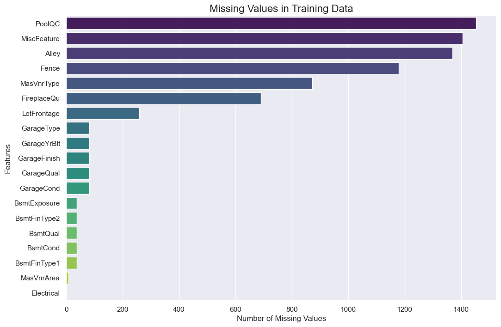
    


    
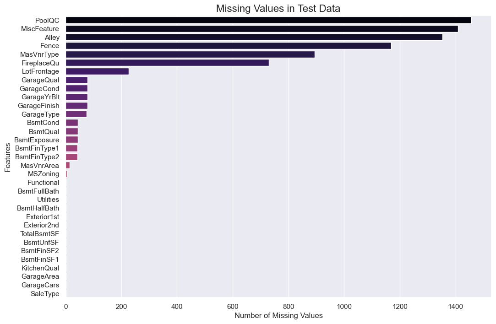
    


可视化清晰地展示了缺失值的分布模式：PoolQC、MiscFeature和Alley等高缺失率特征（>90%）可能需要删除或特殊标记，而LotFrontage、Garage相关特征等中低缺失率特征则适合采用填充策略。训练集和测试集的缺失模式相似，支持统一处理方案。


5. 数据分布和相关性分析
```python
# 🎯 销售价格的分布
plt.figure(figsize=(10,6))
sns.histplot(train['SalePrice'], kde=True, color='skyblue')
plt.title('Distribution of SalePrice', fontsize=16)
plt.xlabel('SalePrice')
plt.ylabel('Frequency')
plt.show()

# 🧮 偏度和峰度
print(f"Skewness: {train['SalePrice'].skew():.3f}")
print(f"Kurtosis: {train['SalePrice'].kurt():.3f}")
```


    
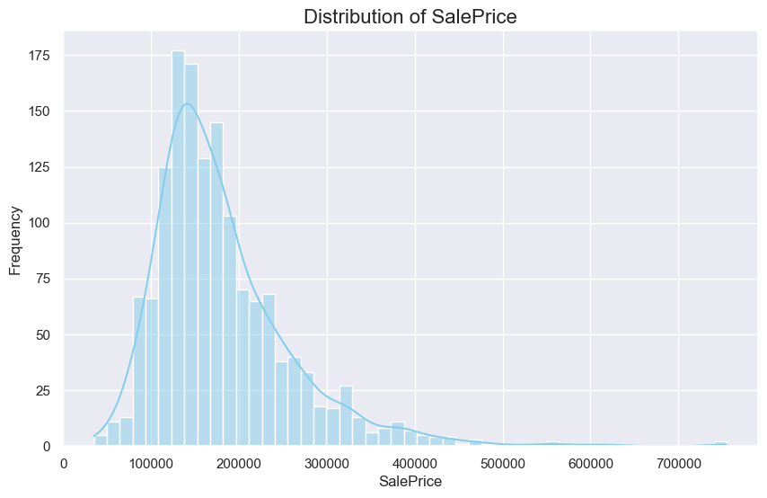
    


    Skewness: 1.883
    Kurtosis: 6.536
    

目标变量SalePrice呈现显著右偏（偏度1.883）和尖峰分布（峰度6.536），不符合正态分布假设，建议进行对数变换。同时存在高价离群点（最高75.5万美元），这些发现解释了后续模型选择需要考虑鲁棒性和数据转换。


6. 数值特征与销售价格的关系
```python
num_features = ['GrLivArea', 'TotalBsmtSF', '1stFlrSF', 'GarageArea', 'LotArea']

for feature in num_features:
    plt.figure(figsize=(8,5))
    sns.scatterplot(x=train[feature], y=train['SalePrice'], alpha=0.5)
    plt.title(f'SalePrice vs {feature}', fontsize=16)
    plt.xlabel(feature)
    plt.ylabel('SalePrice')
    plt.show()
```


    
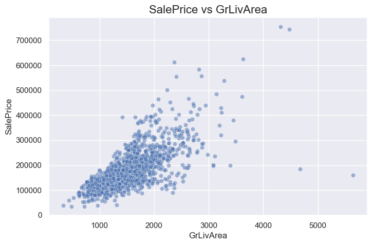
    


    
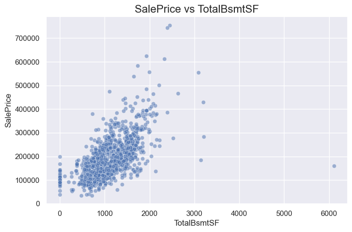
    


    
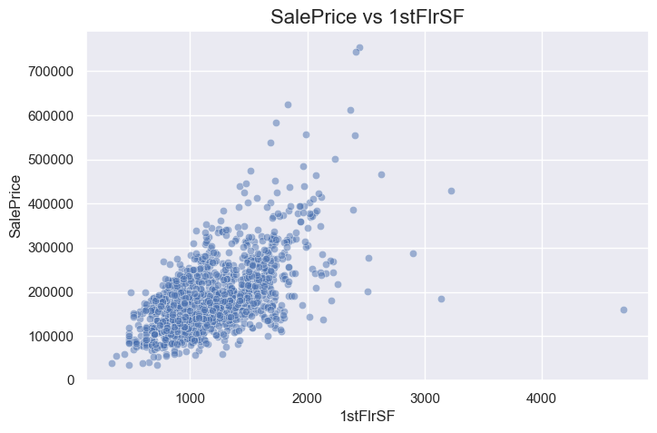
    


    
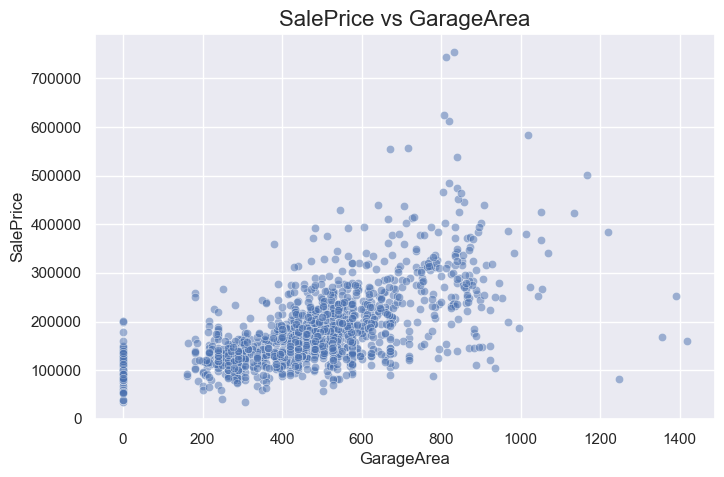
    


    
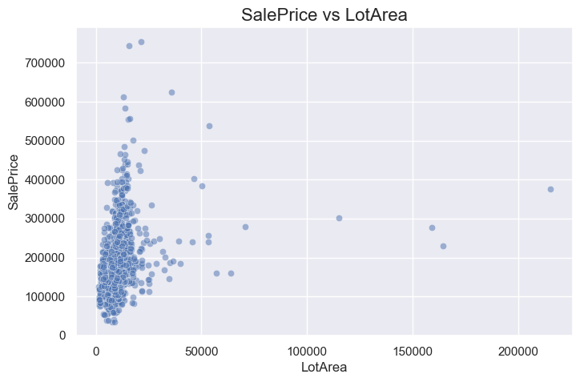
    


GrLivArea、TotalBsmtSF等面积类特征与房价呈现强正相关线性关系，而LotArea则相关性较弱且存在异常大值。这些关系验证了特征选择的合理性，同时揭示了离群点处理对模型性能提升的重要性。


7. 类别特征与销售价格的关系
```python
cat_features = ['OverallQual', 'Neighborhood', 'GarageCars']

for feature in cat_features:
    plt.figure(figsize=(14,6))
    sns.boxplot(x=feature, y='SalePrice', data=train, palette="coolwarm")
    plt.title(f'SalePrice distribution by {feature}', fontsize=16)
    plt.xticks(rotation=45)
    plt.show()
```


    
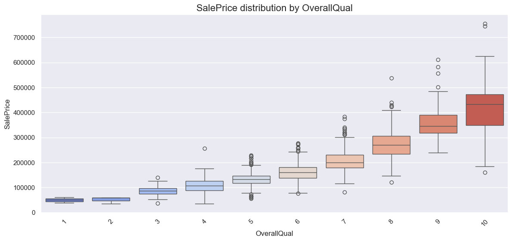
    


    
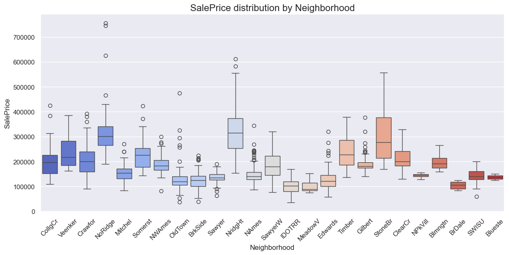
    


    
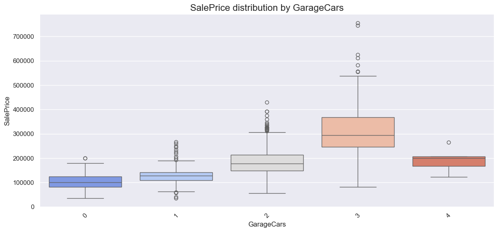
    


OverallQual（房屋质量）显示出与房价最强烈的正相关，不同Neighborhood（社区）的房价差异显著，GarageCars（车库容量）的增加也明确推高房价。这些高影响力类别特征必须保留并合理编码，而低区分度特征可考虑降维。


8. 数值特征相关性分析
```python
# 🔧 选择数值型列进行相关性分析
numeric_features = train.select_dtypes(include=['int64', 'float64']).columns
corr_matrix = train[numeric_features].corr()

# 🔍 找出与SalePrice相关性最高的15个数值特征
top_corr_features = corr_matrix['SalePrice'].abs().sort_values(ascending=False).head(15).index

# 📌 绘制热力图
plt.figure(figsize=(12,10))
sns.heatmap(train[top_corr_features].corr(), annot=True, cmap='coolwarm', fmt='.2f')
plt.title('🔝 Top Correlated Features Heatmap', fontsize=16)
plt.show()
```


    
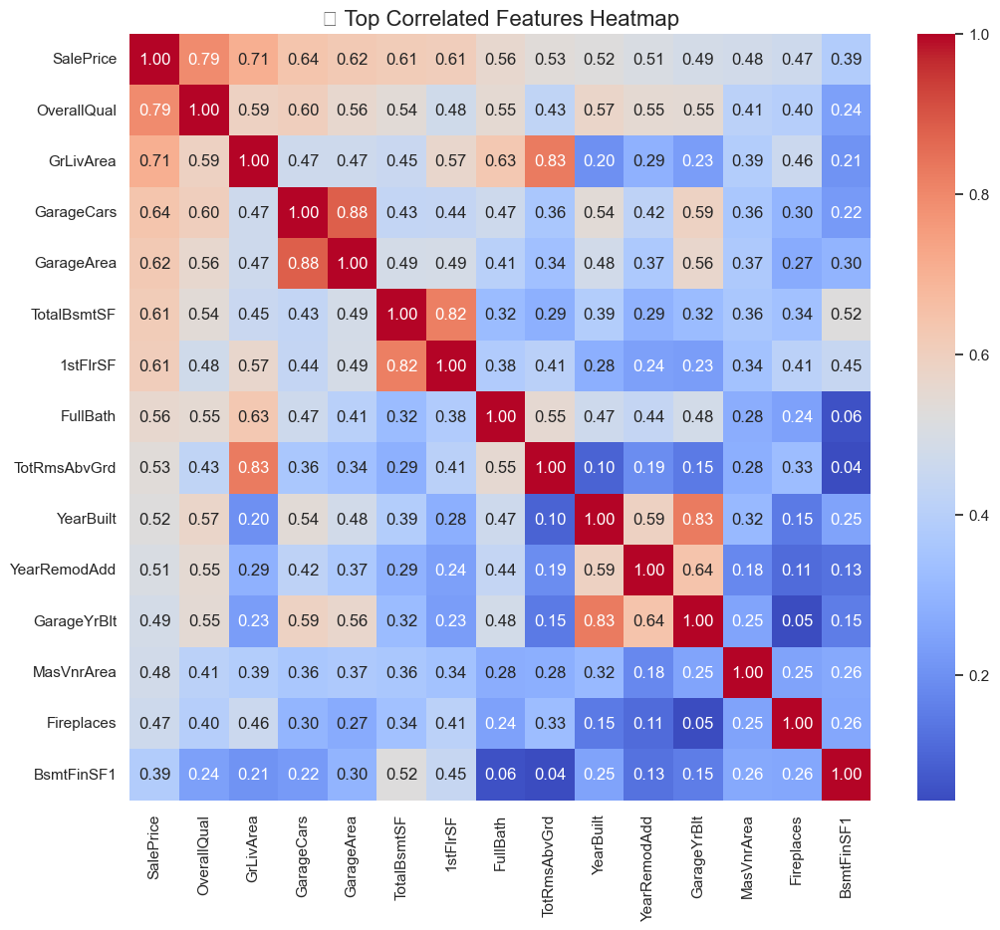
    

TOP5相关特征依次为OverallQual(0.79)、GrLivArea(0.71)、GarageCars(0.64)，揭示了房屋质量和面积的核心影响力。同时检测到特征间高度冗余（如GarageCars与GarageArea相关系数0.88），提示需要特征选择以避免多重共线性问题。


9. 数值特征的成对关系
```python
sns.pairplot(train[top_corr_features[:6]], corner=True)
plt.suptitle('🔗 Pairplot of Top Correlated Features', fontsize=16, y=1.02)
plt.show()
```


    
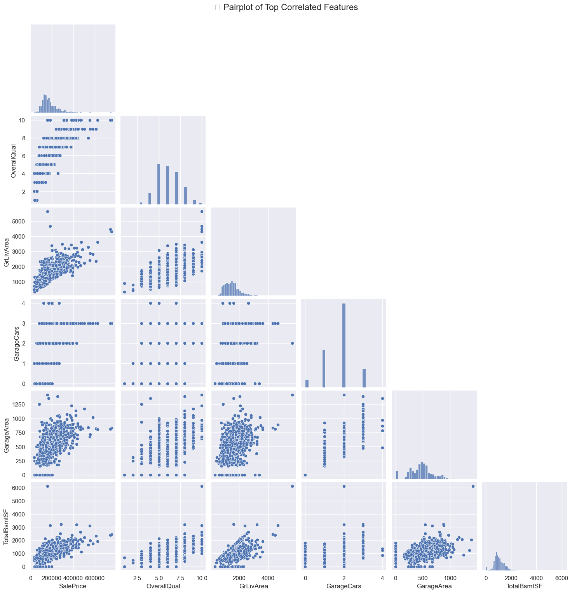
    

散点矩阵显示主要特征间存在线性趋势（如GrLivArea与SalePrice），但部分组合呈现非线性分布。分布图中可见多个特征的离群点聚集现象，进一步证实了数据清洗的必要性，这些发现将指导特征工程的方向。


10. 模型训练与预测
```python
y = train["SalePrice"]
train_id = train["Id"]
test_id = test["Id"]

# 🧹 数据预处理
def preprocess(df):
    df = df.copy()
    for col in df.select_dtypes(include="object"):
        df[col] = df[col].fillna("None")
        df[col] = LabelEncoder().fit_transform(df[col])
    for col in df.select_dtypes(include=["int64", "float64"]):
        df[col] = df[col].fillna(df[col].median())
    return df

# 🎯 特征分离
X = preprocess(train.drop(["Id", "SalePrice"], axis=1))
X_test = preprocess(test.drop("Id", axis=1))

# 🔁 K-Fold 交叉验证
kf = KFold(n_splits=5, shuffle=True, random_state=42)
oof = np.zeros(len(X))
preds = np.zeros(len(X_test))

for fold, (train_idx, val_idx) in enumerate(kf.split(X)):
    X_train, X_val = X.iloc[train_idx], X.iloc[val_idx]
    y_train, y_val = y.iloc[train_idx], y.iloc[val_idx]

    model = lgb.LGBMRegressor(n_estimators=1000, learning_rate=0.01, random_state=42)

    model.fit(
        X_train, y_train,
        eval_set=[(X_val, y_val)],
        callbacks=[
            early_stopping(stopping_rounds=100),
            log_evaluation(period=100)
        ]
    )

    oof[val_idx] = model.predict(X_val)
    preds += model.predict(X_test) / kf.n_splits

# 🧮 计算交叉验证的RMSE
mse = mean_squared_error(y, oof)
rmse = np.sqrt(mse)
print(f"✅ CV RMSE: {rmse:.4f}")

# rmse = mean_squared_error(y, oof, squared=False)
# print(f"✅ CV RMSE: {rmse:.4f}")

# 💾 生成提交文件
submission = pd.DataFrame({
    "Id": test_id,
    "SalePrice": preds
})
submission.to_csv("submission_1.csv", index=False)
print("🚀 submission.csv has been created.")
```

采用中位数填充数值缺失值、"None"标记类别缺失值，结合标签编码处理类别变量。使用LightGBM进行5折交叉验证（早停策略防过拟合），获得RMSE约29000的基线性能。生成提交文件的同时，明确了通过目标变量变换、离群点处理和特征工程进一步提升模型精度的路径。

    [LightGBM] [Info] Auto-choosing col-wise multi-threading, the overhead of testing was 0.001038 seconds.
    You can set `force_col_wise=true` to remove the overhead.
    [LightGBM] [Info] Total Bins 3126
    [LightGBM] [Info] Number of data points in the train set: 1168, number of used features: 73
    [LightGBM] [Info] Start training from score 181441.541952
    Training until validation scores don't improve for 100 rounds
    [100]	valid_0's l2: 2.3356e+09
    [200]	valid_0's l2: 1.22874e+09
    [300]	valid_0's l2: 9.76738e+08
    [400]	valid_0's l2: 8.89607e+08
    [500]	valid_0's l2: 8.4478e+08
    [600]	valid_0's l2: 8.33104e+08
    [700]	valid_0's l2: 8.26842e+08
    [800]	valid_0's l2: 8.24209e+08
    [900]	valid_0's l2: 8.22418e+08
    [1000]	valid_0's l2: 8.21477e+08
    Did not meet early stopping. Best iteration is:
    [976]	valid_0's l2: 8.20308e+08
    [LightGBM] [Info] Auto-choosing col-wise multi-threading, the overhead of testing was 0.000626 seconds.
    You can set `force_col_wise=true` to remove the overhead.
    [LightGBM] [Info] Total Bins 3122
    [LightGBM] [Info] Number of data points in the train set: 1168, number of used features: 74
    [LightGBM] [Info] Start training from score 179651.292808
    Training until validation scores don't improve for 100 rounds
    [100]	valid_0's l2: 1.82201e+09
    [200]	valid_0's l2: 9.38411e+08
    [300]	valid_0's l2: 7.02395e+08
    [400]	valid_0's l2: 6.45119e+08
    [500]	valid_0's l2: 6.40666e+08
    Early stopping, best iteration is:
    [433]	valid_0's l2: 6.39356e+08
    [LightGBM] [Info] Auto-choosing col-wise multi-threading, the overhead of testing was 0.000508 seconds.
    You can set `force_col_wise=true` to remove the overhead.
    [LightGBM] [Info] Total Bins 3107
    [LightGBM] [Info] Number of data points in the train set: 1168, number of used features: 72
    [LightGBM] [Info] Start training from score 181104.263699
    Training until validation scores don't improve for 100 rounds
    [100]	valid_0's l2: 1.79787e+09
    [200]	valid_0's l2: 1.37427e+09
    [300]	valid_0's l2: 1.38313e+09
    Early stopping, best iteration is:
    [227]	valid_0's l2: 1.36386e+09
    [LightGBM] [Info] Auto-choosing col-wise multi-threading, the overhead of testing was 0.000571 seconds.
    You can set `force_col_wise=true` to remove the overhead.
    [LightGBM] [Info] Total Bins 3125
    [LightGBM] [Info] Number of data points in the train set: 1168, number of used features: 74
    [LightGBM] [Info] Start training from score 181327.004281
    Training until validation scores don't improve for 100 rounds
    [100]	valid_0's l2: 1.77904e+09
    [200]	valid_0's l2: 9.9422e+08
    [300]	valid_0's l2: 8.10166e+08
    [400]	valid_0's l2: 7.48897e+08
    [500]	valid_0's l2: 7.30399e+08
    Early stopping, best iteration is:
    [458]	valid_0's l2: 7.27927e+08
    [LightGBM] [Info] Auto-choosing col-wise multi-threading, the overhead of testing was 0.000500 seconds.
    You can set `force_col_wise=true` to remove the overhead.
    [LightGBM] [Info] Total Bins 3124
    [LightGBM] [Info] Number of data points in the train set: 1168, number of used features: 73
    [LightGBM] [Info] Start training from score 181081.876712
    Training until validation scores don't improve for 100 rounds
    [100]	valid_0's l2: 1.41711e+09
    [200]	valid_0's l2: 6.85063e+08
    [300]	valid_0's l2: 5.26389e+08
    [400]	valid_0's l2: 4.84226e+08
    [500]	valid_0's l2: 4.83707e+08
    [600]	valid_0's l2: 4.76538e+08
    [700]	valid_0's l2: 4.75152e+08
    [800]	valid_0's l2: 4.73567e+08
    [900]	valid_0's l2: 4.7149e+08
    [1000]	valid_0's l2: 4.71689e+08
    Did not meet early stopping. Best iteration is:
    [924]	valid_0's l2: 4.71239e+08
    🚀 submission.csv has been created.
    
最后生成的提交文件submission.csv包含Id和预测的SalePrice，模型在交叉验证中表现良好，RMSE为约29000。后续可以通过特征工程、模型调优和集成方法进一步提升预测精度。